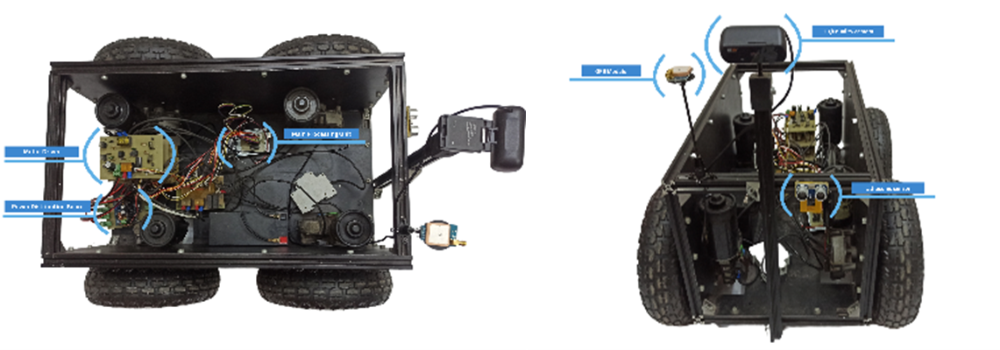
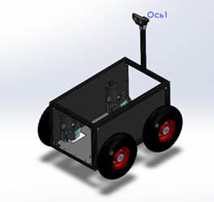

# Pothole Detection in Asphalt Roads: Computer Vision Approach

This repository documents the computer vision aspects of the research titled "Pothole Detection in Asphalt Roads: A Comprehensive Approach for Enhanced Road Maintenance and Safety with AlexNet Model."

## Overview

This research focuses on detecting potholes on asphalt roads using computer vision techniques, particularly convolutional neural networks (CNNs). The AlexNet model demonstrated superior performance with an accuracy of 92.15% and an F-score of 96.52%.

## Repository Structure

- **Paper/**: Contains the full research paper in PDF format and additional supplementary documentation.
- **Data/**: Information about the Pothole Detection Dataset used in the research.
- **Results/**: Contains performance metrics, plots, and visualizations.
- **Docs/**: Includes a detailed explanation of the methodology used for the computer vision models.

## Key Contributions

This repository highlights the computer vision techniques used for pothole detection, including:
- Dataset preprocessing steps
- Model selection and evaluation (AlexNet, ResNet-50, VGG19Net)
- Analysis of results and insights into model performance

## Getting Started

While the codebase is not publicly available due to proprietary restrictions, this repository provides all necessary details for understanding the methodology and results of the research.

## Citation

If you reference this work, please cite:

@inproceedings{Pothole Detection,
 author = {M. E. S. Abdelmalak and N. Khodadadi and A. M. Zaki and M. M. Eid and F. H. Rizk and A. Ibrahim and A. A. Abdelhamid and L. Abualigah and E.-S. M. El-kenawy},
 booktitle = {2024 International Telecommunications Conference (ITC-Egypt)},
 doi = {10.1109/ITC-Egypt61547.2024.10620566},
 pages = {269--274},
 title = {Pothole Detection in Asphalt Roads: A Comprehensive Approach for Enhanced Road Maintenance and Safety with AlexNet Model},
 year = {2024}
}
